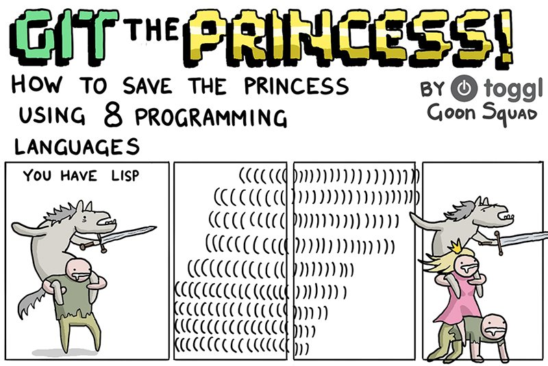

# ¿Qué son los paradigmas?

* Un paradigma es una forma en la cual se pueden abordar problemas para proponer una solución.

* Dependiendo del paradigma se tienen diversas técnicas y estrategias disponibles. Entonces, cierto conjunto de problemas serán más sencillos solucionarlos con ciertos paradigmas y otro conjunto de problemas con otros paradigmas.

---

* Los lenguajes de programación pertenecen a ciertos paradigmas por sus
características, modelo de ejecución y gramáticas

* Un lenguaje puede ser clasificado con múltiples paradigmas

	* Python
	* Ruby
	* JavaScript
	* Perl

---

Estos lenguajes son muy populares y es notable que encontraremos similitudes en aspectos básicos como condicionales, aritmética, colecciones, etc. Sin embargo, diferentes lenguajes son para diferentes cosas

{width=70%}

---

# Las grandes clasificaciones de paradigmas

* **Imperativos:** Secuencia explicita de comandos que actualizan estados
* **Declarativos:** Programación por especificación del resultado que queremos, no "cómo" obtenerlo		
* **Orientados a objetos:** Todas las cosas, o la mayoría, son objetos. Abstracciones del mundo "real"

---

# Programación Estructurada (Imperativa)

* Un tipo de programación **imperativa**
* Definida por ciclos, condiciones y subrutinas (sustituyen los `gotos`)
* Ejecución secuencial del código
* Las variables van mutando con forme se avanza en el tiempo de ejecución

---

# C

{height=70%}

---

# Programación Orientada a Objetos

* Los objetos encapsulan estados (atributos, variables, campos) y comportamientos (metodos).
* Los objetos modifican sus propios estados internos `self`
* Interacción y comunicación atraves de mensajes
* Reusabilidad (Herencia, polimorfismo, interfaces)

## JAVA

```java
// Calcula la longitud (un estado interno) y la devuelve
un_arreglo.length();  
```


---

# Ruby

```ruby
class CuentaBanco
	attr_reader :balance

	def initialize
		@balance = 0
	end

	def deposito cantidad
		@balance += cantidad
	end

	def retiro cantidad
		@balance -= cantidad
	end
end
```

---

```
> cuenta = cuentaBanco.new
#<CuentaBanco...>

> cuenta.balance
0

> cuenta.deposito 200
> cuenta.retiro 50

> cuenta.balance
150
```
---

# Programación Lógica (Declarativa)

* Se basa principalmente en la lógica formal

* Los programas no están basados en instrucciones si no en hecho y clausulas

## Sologismos

"Las cazuelas tienen orejas, Diego tiene orejas. Por tanto, Diego es una cazuela ;)"

---

* En lugar de describir "cómo" resolver un problema describimos el "qué" de la situación

* Elementos
	* `VARIABLE`
	* `coonstante`

---

# Prolog

```prolog
padre(homero, bart).
padre(homero, lisa).
madre(marge, bart).
madre(marge, lisa).
```

---

```prolog
?- madre(X, bart). 
X = marge

?- madre(marge, Y).
Y = bart ? ;
Y = lisa
```
---

# Programación Funcional (Declarativa)



---
title: "Paradigmas de programación"
author: Diego A. Barriga Martínez (@umoqnier)
institute: Laboratorio de Investigación y Desarrollo de Software Libre
logo: 'img/lidsol.png'
theme: Boadilla
colortheme: default
navigation: horizontal
output:
  beamer\_presentation:
    slide_level: 2
---
